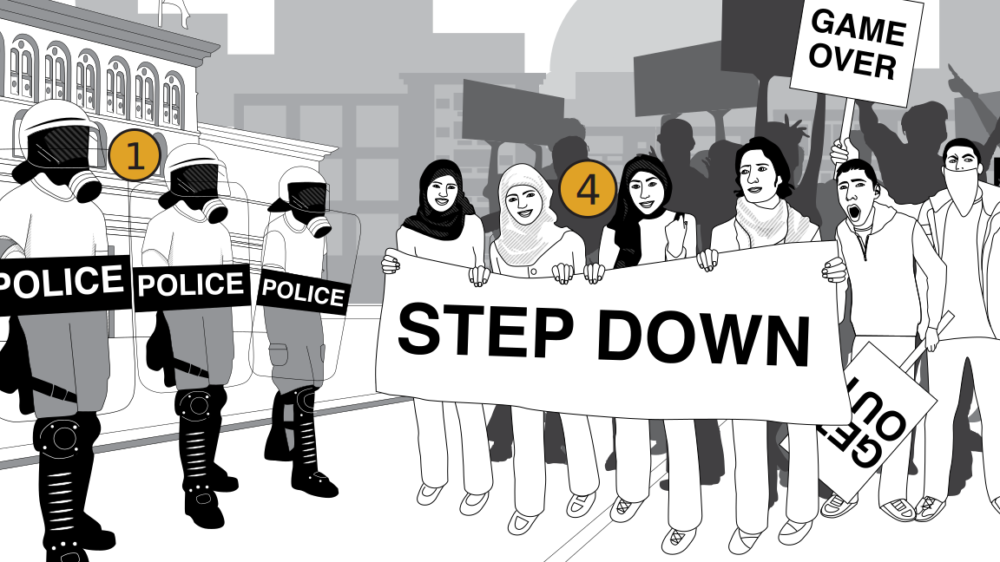
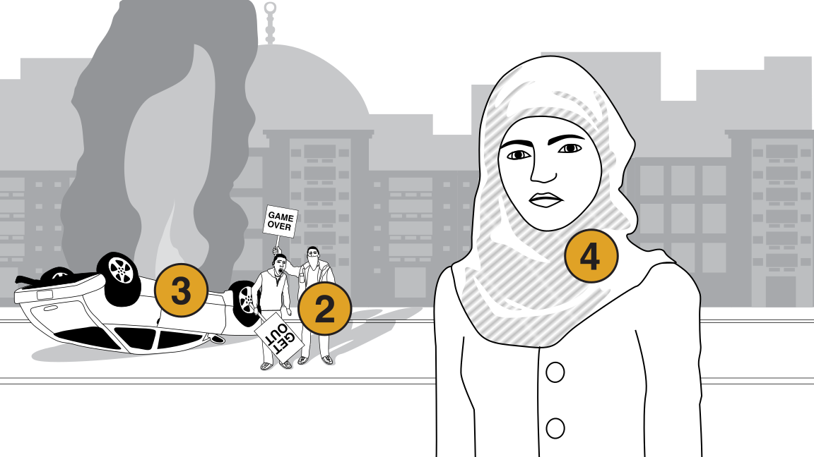
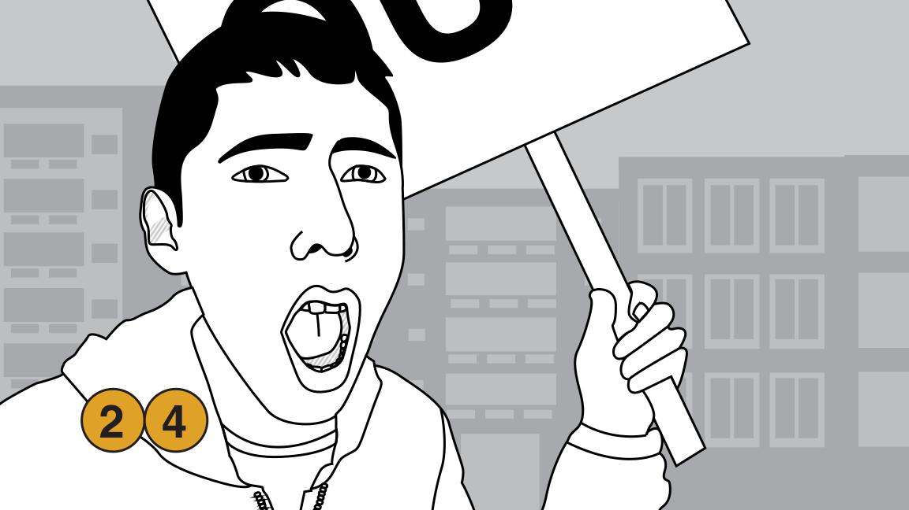

## 1.1 ARE YOU AT RISK?

### Are you living in a dictatorship?

### Is corruption a problem?

### Are police unresponsive to the concerns of citizens?

---------------------------------------

If your answers to any of these questions is Yes then you’re likely to be at risk. Be mindful of the chances you might be taking with your life and as well as others’ lives.

---------------------------------------

### TYPES OF RISK

Risk can come from many places. Be mindful of your surroundings and avoid interacting with anyone you don’t trust.

| .................................................. | .................................................. |  .................................................. |
|-----------|-------------|-------------|
|  |  |  |

#### 1 - Direct Enemies
Police, Military, Gangs, Political Opponents.

#### 2 - Indirect Enemies
People whose actions may harm you.

#### 3 - Environmental
Fires, explosives, weapons, and any other situational dangers.

#### 4 - Personal
Actions you take may harm yourself and others.
